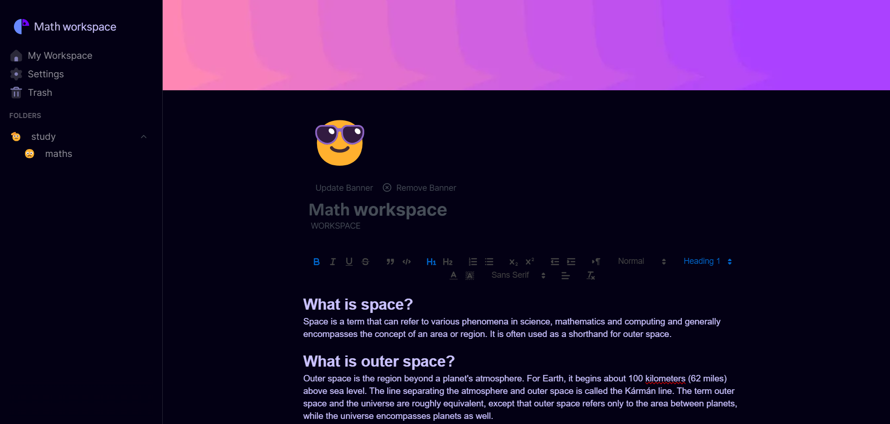
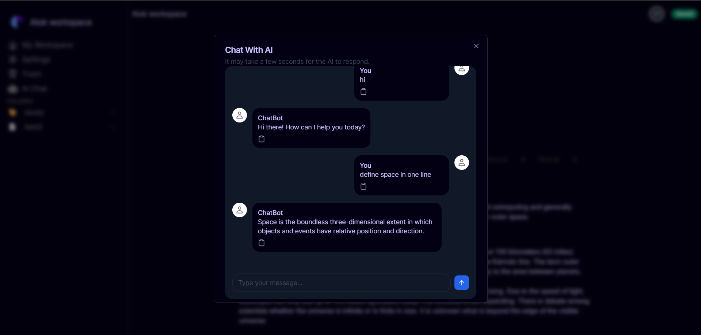

# Grid Space

Welcome to the Grid Space project! This is an open-source project aiming to replicate the core functionalities of Notion, using modern web development technologies such as Next.js, TypeScript, Tailwind CSS, and Supabase.

[](https://notion-v2.vercel.app/)


[](https://github.com/alok-mishra143/notionV2)




## Features

✨ **Dynamic Page Creation**: Create and manage pages dynamically, similar to Notion.  
📝 **Rich Text Editor**: Edit content with a rich text editor.  
🗄️ **Database Integration**: Utilize Supabase for backend database services.  
📱 **Responsive Design**: Mobile-friendly UI built with Tailwind CSS.  
🔐 **Authentication**: Secure user authentication with Supabase Auth.  
🤝 **Real-time Collaboration**: Collaborate in real-time on pages.


## Generate content using AI


.png)


.png)





## Realtime cursor sync between users in a shared workspace

.png)


.png)

## Technologies Used

- **Next.js**: A React framework for server-side rendering and static site generation.
- **TypeScript**: A statically typed superset of JavaScript.
- **Tailwind CSS**: A utility-first CSS framework for rapid UI development.
- **Supabase**: An open-source Firebase alternative providing database and authentication services.

## Getting Started

### Prerequisites

Make sure you have the following installed on your machine:

- Node.js (>=14.x)
- npm or yarn
- Supabase account and project setup

### Installation

1. **Clone the repository:**

   ```sh
   git clone https://github.com/Mannan8374/grid-space.git
   cd grid-space
   ```

2. **Install dependencies:**

   Using npm:

   ```sh
   npm install
   ```

   Or using yarn:

   ```sh
   yarn install
   ```

3. **Setup environment variables:**

   Create a `.env` file in the root directory and add the following:

   ```env
   DATABASE_URL=your-database-url
   NEXT_PUBLIC_SUPABASE_URL=your-supabase-url
   NEXT_PUBLIC_SUPABASE_ANON_KEY=your-supabase-anon-key
   SERVICE_ROLE_KEY=your-service-role-key
   PW=your-password
   NEXT_PUBLIC_SITE_URL=http://localhost:3000/
   BARD_API_KEY=your-gemini-api-key
   ```

   Replace the placeholder values with your actual Supabase project details.

### Running the Project

Start the development server:

Using npm:

```sh
npm run dev
```

Or using yarn:

```sh
yarn dev
```

Open your browser and navigate to `http://localhost:3000` to see the application running.

## Contributing

We welcome contributions! Follow these steps to contribute:

1. Fork the repository.
2. Create a new branch (`git checkout -b feature/your-feature-name`).
3. Make your changes.
4. Commit your changes (`git commit -m 'Add some feature'`).
5. Push to the branch (`git push origin feature/your-feature-name`).
6. Open a pull request.

Please ensure your code adheres to our coding standards and passes all tests.


## Acknowledgements

- [Next.js](https://nextjs.org/)
- [TypeScript](https://www.typescriptlang.org/)
- [Tailwind CSS](https://tailwindcss.com/)
- [Supabase](https://supabase.io/)
- [Notion](https://www.notion.so/) for the inspiration

---

If you have any questions or need further assistance, please open an issue or reach out to us.

Happy coding! 🚀

---
